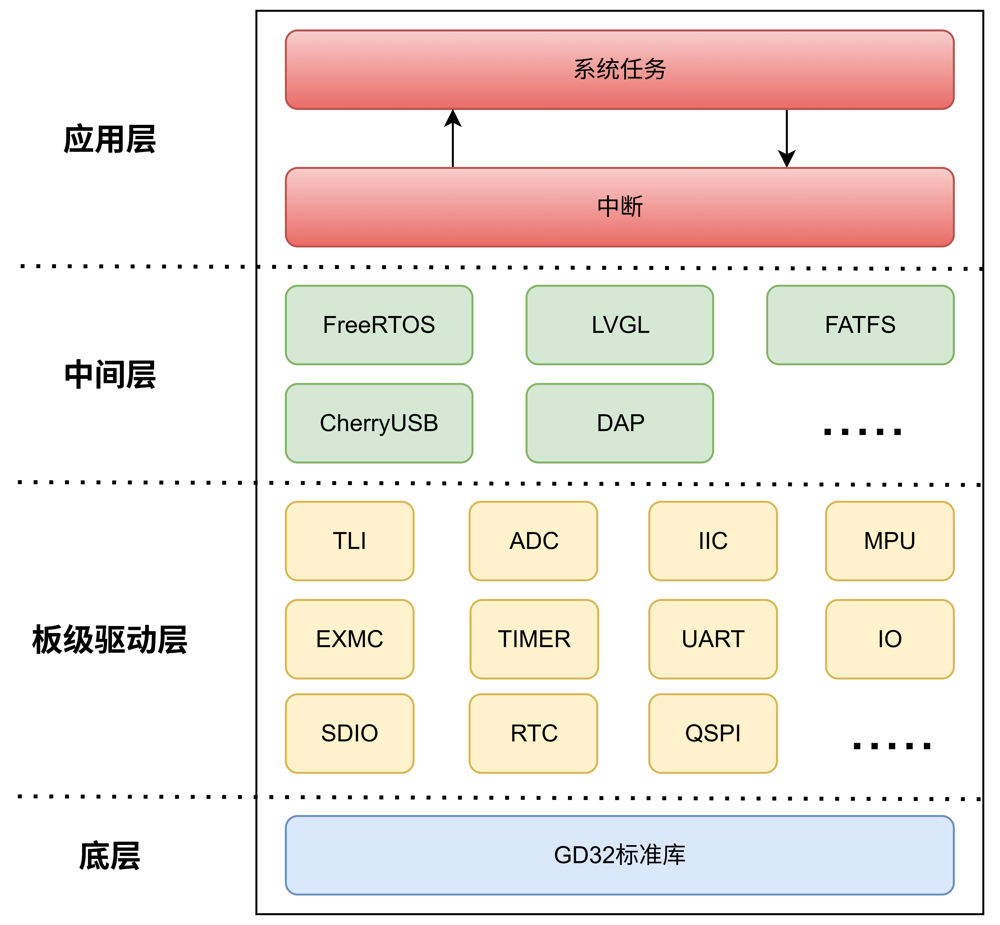

# Multi_Function_Debugger

## 演示视频
[多功能调试器](https://www.bilibili.com/video/BV18QaZz1Ea5/?share_source=copy_web&vd_source=b3485e58203d6e4fd3741fc70a7503aa)

## 硬件开源链接
[多功能调试器](https://oshwhub.com/zh67888/duo-gong-neng-diao-shi-qi)

## 软件架构


## 环境设置
在vscode需要装上Arm Keil Studio Pack (MDK v6)插件才能直接使用当前工程，或者使用源文件自己设置keil工程

生成工程后将下方代码添加到.clangd以屏蔽未使用头文件警告
```shell
Diagnostics:
  UnusedIncludes: None
```
禁用头文件自动插入
```shell
Completion:
  HeaderInsertion: Never
```

## TODO
- [ ] w25q256.c/.h目前可以兼容GD25Q256EYIG, 但是两者的寄存器定义有差别，目前仅兼容了基础的读写功能，可能有些功能GD25Q256EYIG还不能使用
